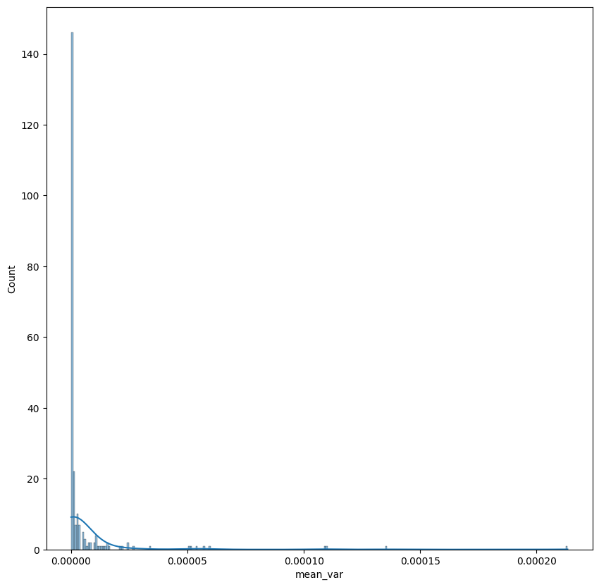
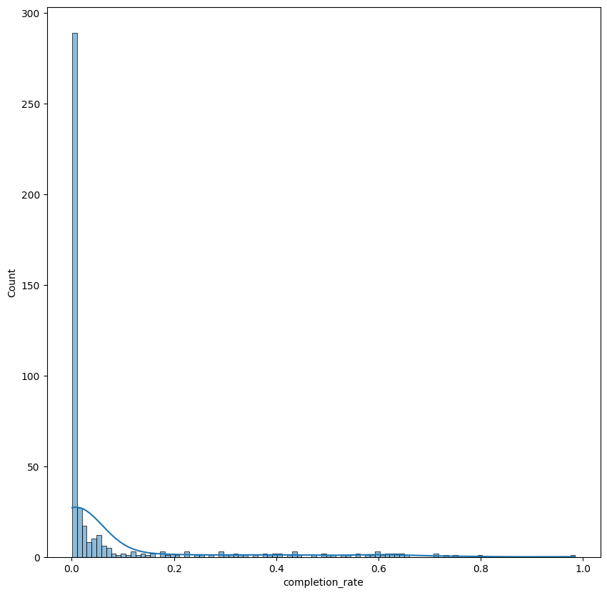
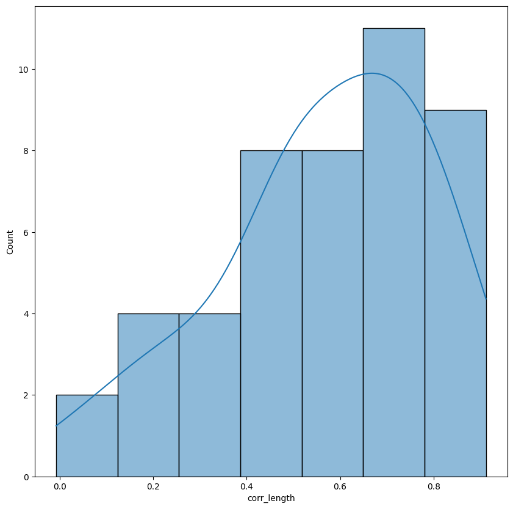
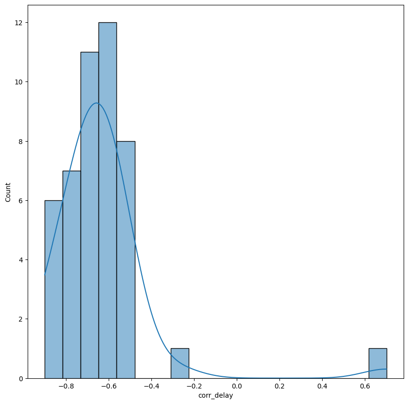
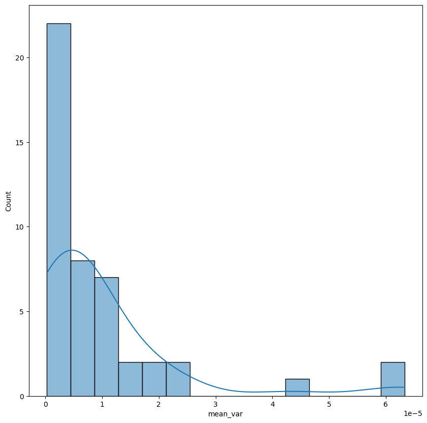
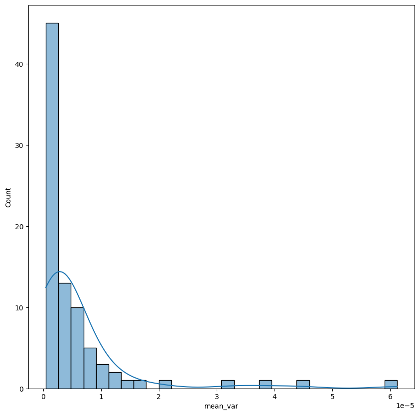

# EDA Result

## Objective 

To find several insights that can be helpful to create a traffic jam classification model on Bogor

## Alerts Dataset

- < 10% of the rows have null value on one of its attributes, those rows were being dropped and not being included in the analysis
- There were 234 streets on this dataset
- For several streets, there were multiple value on 'avg_location' attribute
  - In order to achive the uniqueness on that attribute, mean value of each coordinate were used on each street that has more than one value on that attributes
  - Also, variance related to each 'avg_location' coordinate on each street is being computed to check the consistency of the dataset
- Overall, variance value that being computed can be considered low, so we can conclude that the dataset were consistent. 
  - Because of that, the dataset can be the source of truth of the street location
  

## Jams Dataset

This dataset will be the main source of data for the modeling part

- +/- 1% of the rows have null value on one of its attributes, those rows were being dropped and not being included in the analysis
- There were 454 streets in the dataset and contains 100529 rows
- The dataset has time span
  - Min Timestamp: 2022-07-06 00:00:00
  - Max Timestamp: 2022-09-06 00:00:00
- The dataset can't be considered as a full historical data, because the dataset only cover +/- 14% of the expected full historical data 
  -  Expected full historical data are being computed by multipying number of days, number of hour on each day (24) and number of streets
- There were several area that has more than one row of data in a timestamp
  - Expectation: For each location and timestamp, there were only one row of data
  - In order to meet the expectation, these steps were conducted:
    - For each location and timestamp that only has 1 row, insert it into the final dataset
    - For each location and timestamp that has more than 1 row, insert the row that has highest number of report. If there were several rows that have the highest number of report, pick randomly one row
      - **Used Assumption**: Higher number of reports indicates the information was more reliable
  - Those steps were resulting +/- of data were removed
    - Remaining rows = 51848
- Most of the street has a low number of rows. Because of that, completion rate (number of rows on the data/number of rows that is being needed to create a full historical data) on each street were being computed. Higher number of completion rate on street indicates the street is being jammed oftenly. These were the stats:
  - min = 0.000672
  - 25% percentile = 0.001344
  - 50% percentile = 0.004032
  - 75% percentile = 0.038306
  - max = 0.038306
- Below is the histogram of completion rate
  

- Related to previous information, further analysis and modeling only included several streets that have completion rate more than 90% percentile of completion rate data
  - It is related to the objective of the modeling, that is to prevent traffic jams on Bogor
    - To create bigger impact related to that, the prevention process can be done on several streets that are often jammed
  - Also, if all of the data are being used, then the dataset will be an more imbalanced dataset. It is because, on the modeling part, the jams dataset will be converted into full historical data. Whereas the missing data will be considered as data with jam level equals to 0
    - That conditions can give negative effects on the model performance 
- After filtering out the data from all of unused street data, the remaining rows of the data is 37001
- There were several attributes that has medium-high correlation on each street, it is: 
  - median_speed_kmh with median_length (with average equals to 0.566587)

  - median_speed_kmh with median_delay (with average equals to -0.637149)

  - Those information can be used later on on the data preprocessing
- Coordinates of each street also being computed on this dataset
  - For each rows, calculate the mean dan variance of longitude and latitude 
  - After that, calculate the mean value of mean and variance of longitude and latitude on each street
  - At the final result:
    - The mean value of latitude and longitude data on each street will be treated as the location of the street
    - The variance value of each street will indicates the consistency of the location data
- Mean value of variance on each street can be considered low, so we can conclude that the dataset were consistent. 
  - Because of that, the dataset can be the source of truth of the street location

## Irregularities Dataset

- There were two useless attributes: 
  - cause_type: only has NULL value
  - median_jam_level: has exact same value with jam_level on each row
- There were 85 streets in the dataset and contains 4051 rows
- The dataset has time span
  - Min Timestamp: 2022-07-06 09:00:00.000
  - Max Timestamp: 2022-09-04 21:00:00.000
- The dataset can't be considered as a full historical data, because the dataset only cover +/- 14% of the expected full historical data 
  -  Expected full historical data are being computed by multipying number of days, number of hour on each day (24) and number of streets
- Coordinates of each street also being computed on this dataset with the exact same process with Jams dataset
- Mean value of variance on each street can be considered low, so we can conclude that the dataset were consistent. 
  - Because of that, the dataset can be the source of truth of the street location
  

## Comparasion between Dataset

- There were several street that being used for further analysis on modeling that don't appear on the irregularities dataset. So that dataset can't be used as source of truth of street location
- Meanwhile, alert dataset have all used streets and it has relatively low difference if compared to location data at jams dataset, but the variance value on that dataset is bigger than variance value on the jams dataset
  - So, the jams dataset will be used as the source of truth about the street location in order to maintain the consistency
- There were several differences on median_speed attribute on Jams Dataset and Irregularities Dataset. 
  - For further analysis, median_speed attribute on Jams dataset will be used because it is more complete and based on the modeling objective that closely related to jams