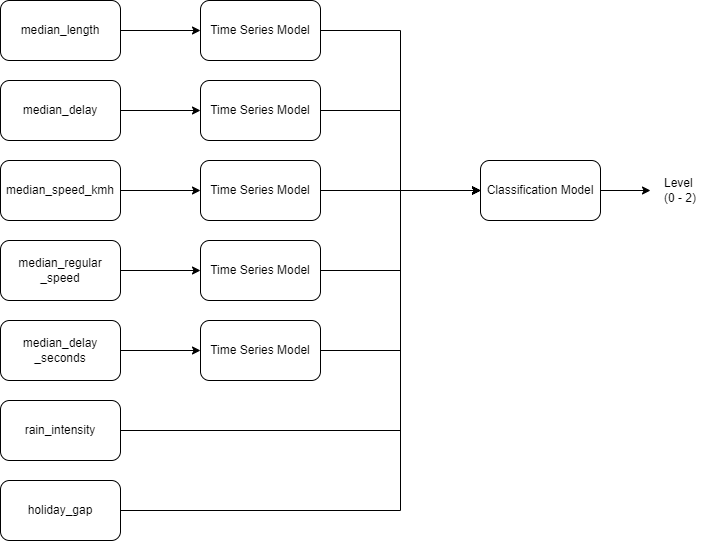

# Modeling 

To predict the traffic jam level, a two-steps  model was used. There were several attributes that are being used to predict traffic jam level such as 'median_length', 'median_delay', 'median_speed_kmh', 'median_regular_speed' 'median_delay_seconds', 'rain_intensity', and 'holiday_gap'. Those attributes has various type, for the 5 first attribute can be indicated as a time-series related attributes and the other were regular numerical attributes. 

The model has input a timestamp and a street name related to a city. The output of the model is traffic jam level on related street and timestamp that has 3 possible value (0, 1, and 2). At first, the model will predict all of the time-series related attributes on the related street and timestamp. After that, the result from the preivous step were used as several attributes to predict the traffic jam level with the other attributes. The non time-series related attribute value can be got from internal database and weather prediction API. Below are the scheme of the inference process:

## Time Series

All of the time-series related attributes have unique model configuration on each used street. The used model is ARIMA. At first, SARIMA model also want to be used as a comparison but due to lack of computation resource so the model couldn't be used. Below are the specification of time series model partition for modeling:

- train_set: Start from 2022-07-06 09:00:00.000
- test_set: Start from 2022-08-24 00:00:00.000

At the training phase, several parameters related to the model that have best performance were being searched using the auto_arima package. The result of the modeling phase on this section is several parquet files that located on 'model/time_series/' that are containing the best parameter on each model. 

## Classification

Below are the several models were used on the experiment to create the classification model
- Linear Regression
- Support Vector Machine
- Naive Bayes
- Decision Tree
- Random Forest
- LightGBM
- XGBoost

For all of those models, the baseline model were created by train those models only using the default parameter that has been determined by the used package and do the evaluation process using test dataset to measure the performance of each models in a basic situation. After that, the hyperparameter tuning process were carried out by training all of those models using several hyperparameter combination that can be seen on 'src/models/classifier_hyperparameter_tuning.py'. On the hyperparameter tuning process, all of the models were trained using the train dataset, and for all of the models that have been trained, evaluation process using validation dataset were carried out to get top-n models that have best performance. Those top-n models are being used for next evaluation process using to determine which model and parameter combination that has best performance. Below are the specification of classification model partition for modeling:

- train_set: Start from 2022-07-06 09:00:00.000
- valid_set: Start from 2022-08-24 00:00:00.000
- test_set: Start from 2022-08-31 00:00:00.000

When doing the evaluation process using validation and test dataset, all models were using the prediction result from the time series model as the input. From that process, it is expected that the final model can be robust because it involves the error that being made by the time series model. 

On the classification modeling, not all of the models are being saved into a .pkl file. Only baseline and top-n models that based on hyperparameter tuning process that are being saved. All of models that already being saved can be accessed [here](https://drive.google.com/drive/folders/1ggnN-8U1EFhfKTD1XAab97H1upk81jEB?usp=share_link)